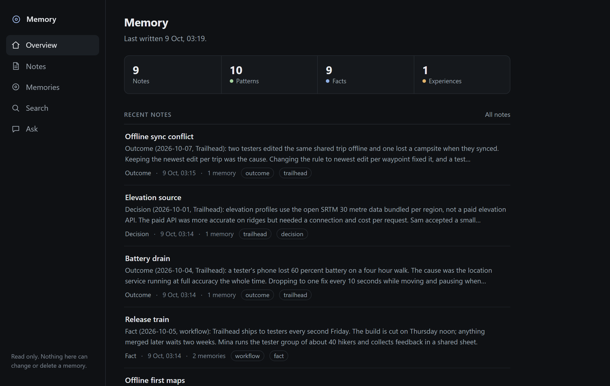
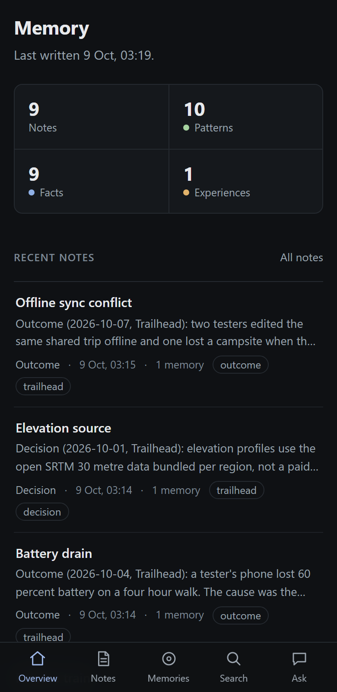
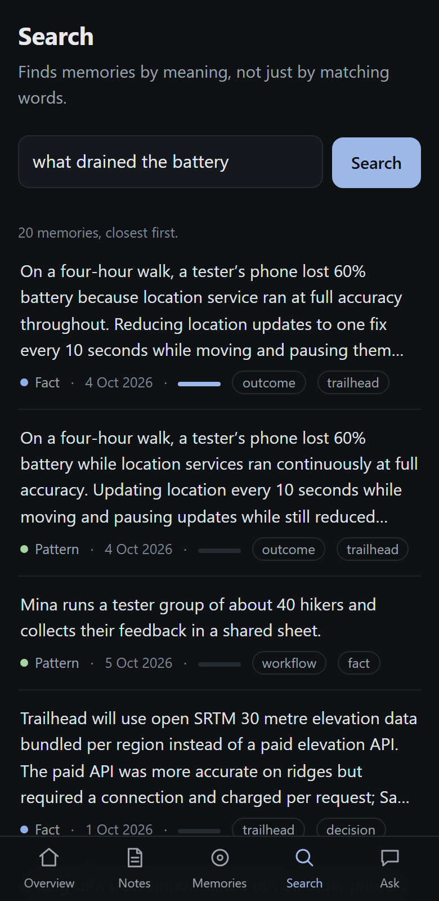
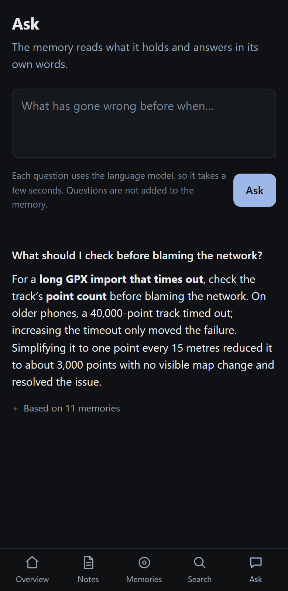
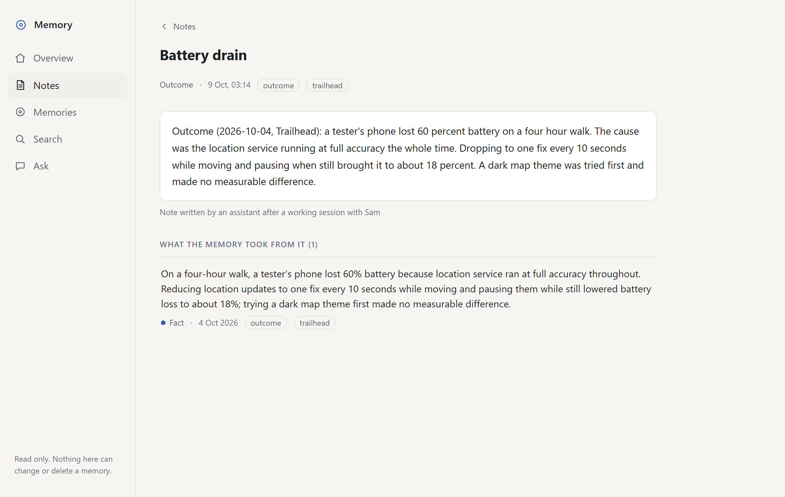
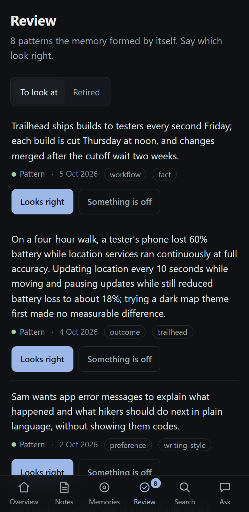

# memory-page

A small web page for browsing a [Hindsight](https://github.com/vectorize-io/hindsight) memory bank
from a phone or a browser. It is read-only, with an optional Review section for retiring facts the
memory got wrong.

Hindsight comes with its own web page for managing a bank. This one does less on purpose: it is for
reading what the memory holds, it works on a phone, and as it comes it cannot change anything.



<p>
  
  
  
</p>

The notes in these pictures are made up.

## What it shows

| Section | What is there |
| --- | --- |
| Overview | Counts of notes, patterns, facts and experiences, the latest notes, and the topics in use |
| Notes | Every note that was written to the bank, newest first, with a filter by topic. A note opens to its full text and the memories drawn from it |
| Memories | The bank's memories by kind: patterns (what Hindsight concluded by putting notes together), facts and experiences. A memory opens to its details and, for a pattern, the memories it was built from |
| Search | Hindsight's recall: finds memories by meaning, closest first |
| Ask | Hindsight's reflect: answers a question from what the bank holds, and lists the memories it used |
| Review (optional) | The patterns formed since you last looked. Say which look right, or open one to see the facts behind it and retire the wrong one |

It follows the device's light or dark setting. On a phone the sections sit in a bar at the bottom; on
a wide screen they move to the side.



## How read-only works

The page is static files. It never holds the Hindsight API key and never talks to Hindsight directly.

A Caddy server serves the files and passes on a short list of calls, adding the key itself:

- `GET` for statistics, tags, documents and memories;
- `POST` for recall and reflect, which read but do not write.

Everything else under `/api` is refused with a 403: storing, reprocessing, deleting, configuration,
export and import. The list is in the [Caddyfile](Caddyfile), and it is short enough to read.

## Review

Hindsight builds patterns by putting facts together, and a language model can get a fact wrong. Review
is a place to check what it concluded without reading every entry.

It lists the patterns you have not looked at, or that were rebuilt since you did. For each one you
say it looks right, or open it to see the facts it was built from and retire the wrong one. Hindsight
then drops the pattern and rebuilds it from what is left. A retired fact is kept, listed under
Retired, and can be brought back. A pattern cannot be retired directly, because it is derived.

<p></p>

Review needs to write, so it is off unless you run the small service in [review/](review/review.py)
and point `REVIEW_UPSTREAM` at it. The page talks to that service, not to Hindsight, for these calls:

- remember that a pattern was looked at (kept in a file, so every device sees the same list);
- retire one fact, with an optional reason;
- bring a retired fact back.

The service builds each request to Hindsight itself from a checked memory id. It cannot change a
memory's words, delete anything, or reach another bank. It is one Python file with no dependencies.

## Run it

You need a running Hindsight and Docker. Put this folder beside your Hindsight compose file and add
the service from [compose.example.yaml](compose.example.yaml) to it, so the page can reach Hindsight
on the compose network:

```yaml
  memory-page:
    image: caddy:2-alpine
    restart: unless-stopped
    ports:
      - "127.0.0.1:9998:9998"
    environment:
      HINDSIGHT_API_KEY: ${HINDSIGHT_API_KEY}
      HINDSIGHT_BANK: default
      HINDSIGHT_UPSTREAM: hindsight:8888
      PAGE_HOSTS: "localhost 127.0.0.1"
    volumes:
      - ./memory-page/Caddyfile:/etc/caddy/Caddyfile:ro
      - ./memory-page/site:/srv:ro
```

Then start it and open `http://127.0.0.1:9998`:

```
docker compose up -d memory-page
```

| Setting | Meaning | Default |
| --- | --- | --- |
| `HINDSIGHT_API_KEY` | The key Hindsight expects as a bearer token. Leave it empty if yours has none | none |
| `HINDSIGHT_BANK` | The bank to read | `default` |
| `HINDSIGHT_UPSTREAM` | Where Hindsight's API listens, as `host:port` | `hindsight:8888` |
| `PAGE_HOSTS` | The names or addresses you open the page by, separated by spaces, without the port. Requests under any other name are refused | `localhost 127.0.0.1` |
| `REVIEW_UPSTREAM` | Where the review service listens, as `host:port`. Unset means no Review section | unset |

To switch Review on, add the second service from [compose.example.yaml](compose.example.yaml) and set
`REVIEW_UPSTREAM: memory-review:8080` on the page.

There is no build step. To change the page, edit the files in `site/` and reload.

## Before you expose it

- **There is no login.** Anyone who can reach the port can read the whole bank and ask it questions,
  and with Review on, retire facts.
  The example binds to `127.0.0.1`. Reach it over a private network such as Tailscale or a VPN, or
  put your own sign-in in front of it. Do not put it on the open internet.
- **Name the hosts you open it by.** If you reach the page as `http://my-server:9998`, add
  `my-server` to `PAGE_HOSTS`. The page refuses any other name, which stops another website from
  pointing a name of its own at your server and reading the bank through your browser.
- **Ask spends your language model.** Each question is one reflect call on whatever model your
  Hindsight uses. Search and browsing use none.
- It reads one bank, the one named in `HINDSIGHT_BANK`.

## Limits

- Written against Hindsight 0.10.3. A later release may change the API it reads.
- It shows mental models and directives nowhere, and has no graph view.
- Tried in Chromium on a desktop and in a browser on an iPhone. Other browsers are untried.

## Licence

MIT. See [LICENSE](LICENSE).
